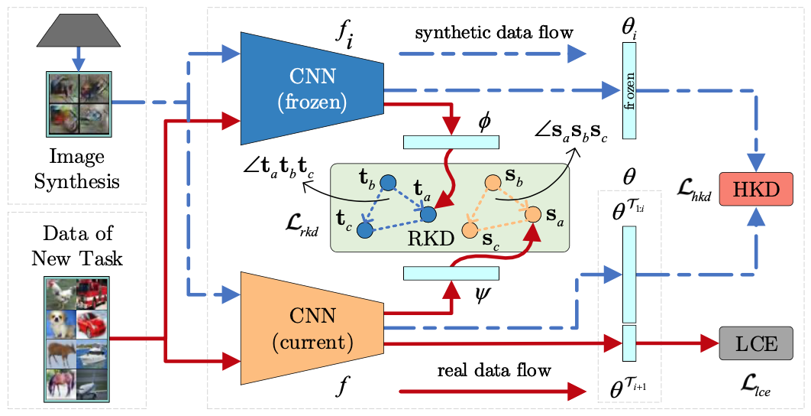

## R-DFCIL: Relation-Guided Representation Learning for Data-Free Class Incremental Learning



The official PyTorch implementation of R-DFCIL introduced in the following paper:

> [Qiankun Gao](https://github.com/gqk), Chen Zhao, Bernard Ghanem, [Jian Zhang](https://github.com/jianzhangcs);
>
> R-DFCIL: Relation-Guided Representation Learning for Data-Free Class Incremental Learning;
>
> European Conference on Computer Vision (ECCV), 2022.

This repo is based on [cl-lite](https://github.com/gqk/cl-lite), see [Experiment](#experiment) for usage.

## Introduction

Class-Incremental Learning (CIL) struggles with catastrophic forgetting when learning new knowledge, and Data-Free CIL (DFCIL) is even more challenging without access to the training data of previously learned classes. Though recent DFCIL works introduce techniques such as model inversion to synthesize data for previous classes, they fail to overcome forgetting due to the severe domain gap between the synthetic and real data. To address this issue, this paper proposes relation-guided representation learning (RRL) for DFCIL, dubbed R-DFCIL. In RRL, we introduce relational knowledge distillation to flexibly transfer the structural relation of new data from the old model to the current model. Our RRL-boosted DFCIL can guide the current model to learn representations of new classes better compatible with representations of previous classes, which greatly reduces forgetting while improving plasticity. To avoid the mutual interference between representation and classifier learning, we employ local rather than global classification loss during RRL. After RRL, the classification head is refined with global class-balanced classification loss to address the data imbalance issue as well as learn the decision boundaries between new and previous classes. Extensive experiments on CIFAR100, Tiny-ImageNet200, and ImageNet100 demonstrate that our R-DFCIL significantly surpasses previous approaches and achieves a new state-of-the-art performance for DFCIL.

## Experiment

- Install dependencies

    ```shell
    pip install -r requirements.txt
    ```
- Prepare datasets

    1. create a dataset root diretory, e.g., data
    2. cifar100 will be automatically downloaded
    3. download and unzip [tiny-imagenet200](http://cs231n.stanford.edu/tiny-imagenet-200.zip) to dataset root diretory
    4. follow [PODNet](https://github.com/arthurdouillard/incremental_learning.pytorch/tree/master/imagenet_split) to prepare imagenet100 dataset
    5. the overview of dataset root diretory

        ```shell
        ├── cifar100
        │   └── cifar-100-python
        ├── imagenet100
        │   ├── train
        │   ├── train_100.txt
        │   ├── val
        │   └── val_100.txt
        └── tiny-imagenet200
            ├── test
            ├── train
            ├── val
            ├── wnids.txt
            └── words.txt
        ```

- Generate config file (replace `<root>` with your dataset root path)

    ```shell
    python main.py --data.root <root> --print_config > cifar100.yaml
    ```

- Run experiment

    ```shell
    python main.py --config cifar100.yaml
    ```

We provide [configs](./config) and [Makefile](./Makefile) to quickly reproduce the ten-tasks experimental results reported in the paper, run the following command if the `make` has been installed:

```shell
make cifar100
make tiny-imagenet200
make imagenet100
```

Modify fields (e.g., `num_tasks`) in the config files to reproduce other experiments.

## Citation

```
@inproceedings{gao2022rdfcil,
    title = {R-DFCIL: Relation-Guided Representation Learning for Data-Free Class Incremental Learning},
    author = {Qiankun Gao, Chen Zhao, Bernard Ghanem, Jian Zhang},
    booktitle = {European Conference on Computer Vision (ECCV)},
    year = {2022}
}
```
